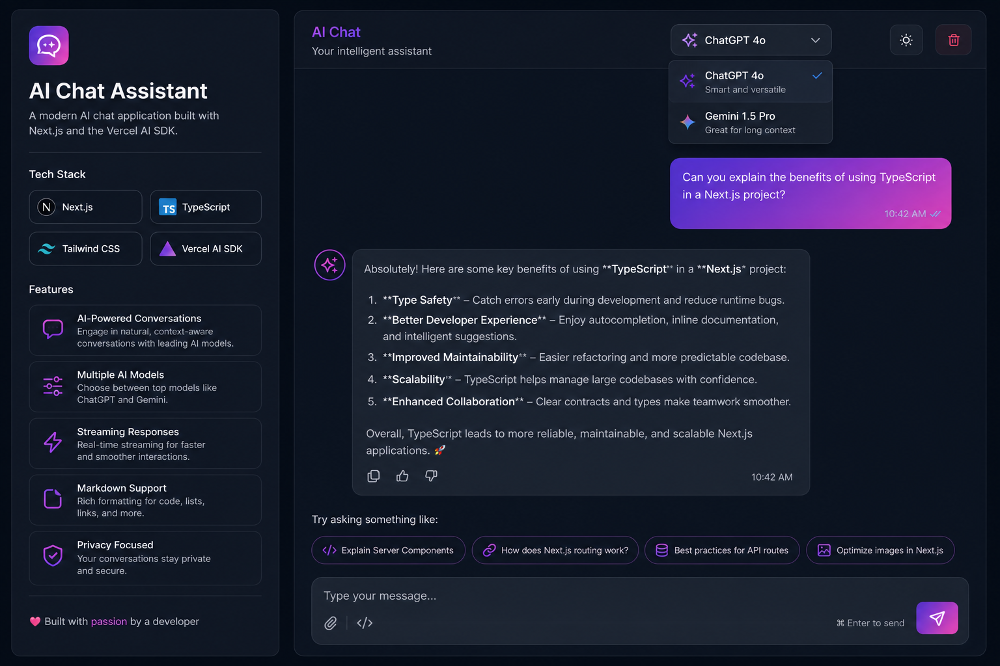
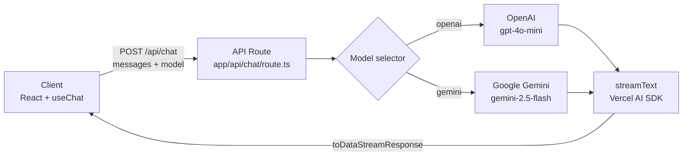

# AI Chat Assistant

A full-stack web chat app that lets you talk to **ChatGPT (OpenAI)** and **Gemini (Google)** from a single interface, with **real-time streaming** responses and **image understanding** (vision). Built with Next.js 14 and the Vercel AI SDK.



**Live demo:** https://ai-chat-assistant-neon-chi.vercel.app

---

## About this project

This is a **portfolio project** by [Diego Gonzalez](https://github.com/DiegoWare) ([@DiegoWare](https://github.com/DiegoWare)). It demonstrates:

- Multi-provider AI integration (OpenAI + Google) behind one unified API
- Real-time streaming UX similar to ChatGPT
- Image attachments with multimodal vision (JPEG, PNG, WebP, GIF)
- Clean full-stack architecture with Next.js App Router
- Production-ready error handling and responsive UI
- Markdown rendering for rich assistant responses

The app itself is a standalone chat product — all portfolio context lives here in the README, not in the UI.

---

## Tech stack

| Category | Technology |
|----------|------------|
| Framework | [Next.js 14](https://nextjs.org/) (App Router) |
| Language | [TypeScript](https://www.typescriptlang.org/) |
| Styling | [Tailwind CSS](https://tailwindcss.com/) |
| AI | [Vercel AI SDK](https://sdk.vercel.ai/) (`ai`) |
| Providers | [@ai-sdk/openai](https://sdk.vercel.ai/providers/ai-sdk-providers/openai), [@ai-sdk/google](https://sdk.vercel.ai/providers/ai-sdk-providers/google) |
| Markdown | [react-markdown](https://github.com/remarkjs/react-markdown) + [remark-gfm](https://github.com/remarkjs/remark-gfm) |
| Deploy | [Vercel](https://vercel.com/) |

---

## Run locally

### Prerequisites

- [Node.js](https://nodejs.org/) 18+
- [OpenAI](https://platform.openai.com/) and/or [Google AI Studio](https://aistudio.google.com/) account
- API keys for the providers you want to use

### Steps

```bash
# 1. Clone the repository
git clone https://github.com/DiegoWare/ai-chat-assistant.git
cd ai-chat-assistant

# 2. Install dependencies
npm install

# 3. Set up environment variables
cp .env.example .env.local
```

Add your keys to `.env.local`:

```env
OPENAI_API_KEY=sk-proj-...
GOOGLE_GENERATIVE_AI_API_KEY=AIza...   # or AQ.... format from AI Studio
```

```bash
# 4. Start the dev server
npm run dev
```

Open [http://localhost:3000](http://localhost:3000) in your browser.

### Scripts

| Command | Description |
|---------|-------------|
| `npm run dev` | Development server |
| `npm run build` | Production build |
| `npm run start` | Production server |
| `npm run lint` | ESLint |

---

## Architecture



### Request flow

1. User sends a message in `ChatWindow` via the `useChat` hook (`ai/react`).
2. Client POSTs message history and selected model to `/api/chat`.
3. API route validates the request and picks a provider in `lib/providers.ts`.
4. `streamText` calls the model and streams tokens back.
5. Client renders the response in real time with markdown support.

### Project structure

```
ai-chat-assistant/
├── app/
│   ├── api/chat/route.ts    # Streaming chat endpoint
│   ├── layout.tsx
│   ├── page.tsx
│   └── globals.css
├── components/
│   ├── ChatWindow.tsx       # Chat logic (useChat)
│   ├── MessageBubble.tsx    # Message bubbles
│   ├── MarkdownContent.tsx  # Markdown rendering
│   ├── ModelSelector.tsx    # ChatGPT / Gemini selector
│   └── ErrorBanner.tsx      # User-visible errors
├── lib/
│   └── providers.ts         # Model configuration
├── docs/
│   └── preview.png
├── .env.example
└── README.md
```

---

## Key technical decisions

### Why Vercel AI SDK?

It unifies multiple AI providers under one API (`streamText`, `useChat`). Switching from OpenAI to Gemini is a one-line change in `lib/providers.ts` — no need to rewrite streaming logic.

### Why streaming?

LLM responses can take several seconds. Streaming improves perceived speed by showing text token by token, like ChatGPT. The SDK handles this with `toDataStreamResponse()` on the server and `useChat` on the client.

### Why Next.js App Router?

API routes colocated with the frontend, server components where useful, and zero-config deploy on Vercel.

### Model choices

| Label | Model ID | Why |
|-------|----------|-----|
| ChatGPT | `gpt-4o-mini` | Strong quality/cost balance for demos |
| Gemini | `gemini-2.5-flash` | Works on Google AI Studio free tier |

### No database

Chat history lives in client state (`useChat`). Keeps the project focused and deployable without infra overhead.

---

## What I learned / future improvements

### Takeaways

- Integrating multiple AI providers through a shared abstraction (Vercel AI SDK)
- Handling streaming responses and API errors (invalid keys, rate limits) with clear user feedback
- Building a responsive chat UI with Tailwind and markdown rendering
- Separating provider config (`lib/providers.ts`) from API route logic

### Roadmap

- [ ] Conversation persistence (database)
- [ ] User authentication
- [ ] File and image uploads
- [ ] Automated tests (unit + e2e)
- [ ] Light / dark mode toggle
- [ ] More providers (Anthropic, Mistral, etc.)

---

## Environment variables

| Variable | Description | Required |
|----------|-------------|----------|
| `OPENAI_API_KEY` | OpenAI API key | Only if using ChatGPT |
| `GOOGLE_GENERATIVE_AI_API_KEY` | Google AI Studio API key | Only if using Gemini |

> **Important:** never commit `.env.local` to git. Set production keys in the Vercel dashboard.

---

## Deploy

### GitHub

```bash
gh auth login
cd ~/Desktop/ai-chat-assistant
gh repo create DiegoWare/ai-chat-assistant --public --source=. --remote=origin --push
```

### Vercel

1. Go to [vercel.com/new](https://vercel.com/new) and import `DiegoWare/ai-chat-assistant`
2. Add environment variables: `OPENAI_API_KEY`, `GOOGLE_GENERATIVE_AI_API_KEY`
3. Deploy — Vercel auto-detects Next.js

Or via CLI:

```bash
npx vercel login
npx vercel --prod
```

After deploy, update the **Live demo** link at the top of this README.

---

## Author

**Diego Gonzalez** — [github.com/DiegoWare](https://github.com/DiegoWare)

---

## License

MIT
