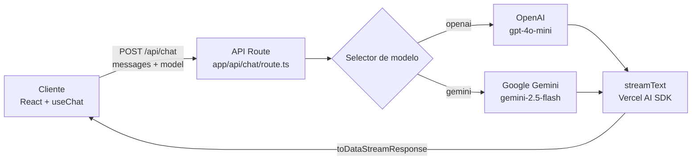

# AI Chat Assistant

Aplicación web de chat con inteligencia artificial que permite conversar con **ChatGPT (OpenAI)** y **Gemini (Google)** desde un mismo interfaz, con respuestas en **streaming** en tiempo real. Proyecto de portfolio full-stack construido con Next.js 14 y Vercel AI SDK.


**Demo en vivo:** _Próximamente — se agregará tras el deploy en Vercel_

---

## Stack técnico

| Categoría | Tecnología |
|-----------|------------|
| Framework | [Next.js 14](https://nextjs.org/) (App Router) |
| Lenguaje | [TypeScript](https://www.typescriptlang.org/) |
| Estilos | [Tailwind CSS](https://tailwindcss.com/) |
| IA | [Vercel AI SDK](https://sdk.vercel.ai/) (`ai`) |
| Proveedores | [@ai-sdk/openai](https://sdk.vercel.ai/providers/ai-sdk-providers/openai), [@ai-sdk/google](https://sdk.vercel.ai/providers/ai-sdk-providers/google) |
| Markdown | [react-markdown](https://github.com/remarkjs/react-markdown) + [remark-gfm](https://github.com/remarkjs/remark-gfm) |
| Deploy | [Vercel](https://vercel.com/) |

---

## Cómo correrlo en local

### Requisitos previos

- [Node.js](https://nodejs.org/) 18 o superior
- Cuenta en [OpenAI](https://platform.openai.com/) y/o [Google AI Studio](https://aistudio.google.com/)
- API keys de los proveedores que quieras usar

### Pasos

```bash
# 1. Clonar el repositorio
git clone https://github.com/diegogonzalez/ai-chat-assistant.git
cd ai-chat-assistant

# 2. Instalar dependencias
npm install

# 3. Configurar variables de entorno
cp .env.example .env.local
```

Edita `.env.local` y agrega tus keys:

```env
OPENAI_API_KEY=sk-proj-...
GOOGLE_GENERATIVE_AI_API_KEY=AIza...   # o formato AQ.... de AI Studio
```

```bash
# 4. Iniciar el servidor de desarrollo
npm run dev
```

Abre [http://localhost:3000](http://localhost:3000) en el navegador.

### Scripts disponibles

| Comando | Descripción |
|---------|-------------|
| `npm run dev` | Servidor de desarrollo |
| `npm run build` | Build de producción |
| `npm run start` | Servidor de producción |
| `npm run lint` | Linter ESLint |

---

## Arquitectura



### Flujo de una conversación

1. El usuario escribe un mensaje en `ChatWindow` (hook `useChat` de `ai/react`).
2. El cliente envía el historial y el modelo seleccionado a `POST /api/chat`.
3. La API route valida la solicitud y selecciona el proveedor en `lib/providers.ts`.
4. `streamText` llama al modelo y devuelve tokens en streaming.
5. El cliente renderiza la respuesta en tiempo real con markdown.

### Estructura del proyecto

```
ai-chat-assistant/
├── app/
│   ├── api/chat/route.ts    # Endpoint de chat con streaming
│   ├── layout.tsx
│   ├── page.tsx
│   └── globals.css
├── components/
│   ├── ChatWindow.tsx       # Lógica del chat (useChat)
│   ├── MessageBubble.tsx    # Burbujas de mensaje
│   ├── MarkdownContent.tsx  # Renderizado markdown
│   ├── ModelSelector.tsx    # Selector ChatGPT / Gemini
│   ├── ProjectIntro.tsx     # Panel de presentación (portfolio)
│   └── ErrorBanner.tsx      # Errores visibles en UI
├── lib/
│   └── providers.ts         # Configuración de modelos
├── docs/
│   └── preview.png          # Captura para README
├── .env.example
└── README.md
```

---

## Decisiones técnicas clave

### ¿Por qué Vercel AI SDK?

Unifica la integración con múltiples proveedores de IA bajo una misma API (`streamText`, `useChat`). Cambiar de OpenAI a Gemini es cuestión de seleccionar otro provider en `lib/providers.ts`, sin reescribir la lógica de streaming.

### ¿Por qué streaming?

Las respuestas de los LLM pueden tardar varios segundos. El streaming mejora la percepción de velocidad al mostrar el texto token a token, igual que ChatGPT. El SDK expone esto con `toDataStreamResponse()` en el servidor y `useChat` en el cliente.

### ¿Por qué Next.js App Router?

API routes colocalizadas con el frontend, server components donde conviene, y deploy directo en Vercel sin configuración extra.

### Modelos elegidos

| Modelo | ID | Motivo |
|--------|-----|--------|
| ChatGPT | `gpt-4o-mini` | Buen equilibrio calidad/costo para demos |
| Gemini | `gemini-2.5-flash` | Compatible con el plan gratuito de AI Studio |

### Sin base de datos

El historial vive en el estado del cliente (`useChat`). Suficiente para una demo de portfolio; evita complejidad innecesaria.

---

## Qué aprendí / qué mejoraría

### Aprendizajes

- Integrar múltiples proveedores de IA con una abstracción común (Vercel AI SDK).
- Manejar streaming de respuestas y errores de API (keys inválidas, rate limits) de forma visible para el usuario.
- Diseñar una UI de chat usable en mobile y desktop con Tailwind.
- Separar configuración de proveedores (`lib/providers.ts`) de la lógica de la API route.

### Mejoras futuras

- [ ] Persistencia de conversaciones (base de datos)
- [ ] Autenticación de usuarios
- [ ] Soporte para subida de archivos e imágenes
- [ ] Tests automatizados (unitarios + e2e)
- [ ] Modo claro / oscuro
- [ ] Más proveedores (Anthropic, Mistral, etc.)

---

## Variables de entorno

| Variable | Descripción | Requerida |
|----------|-------------|-----------|
| `OPENAI_API_KEY` | API key de OpenAI | Solo si usas ChatGPT |
| `GOOGLE_GENERATIVE_AI_API_KEY` | API key de Google AI Studio | Solo si usas Gemini |

> **Importante:** nunca subas `.env.local` a git. Las keys en producción se configuran en el dashboard de Vercel.

---

## Autor

**Diego Gonzalez** — proyecto de portfolio para demostrar desarrollo full-stack con IA.

---

## Licencia

MIT
